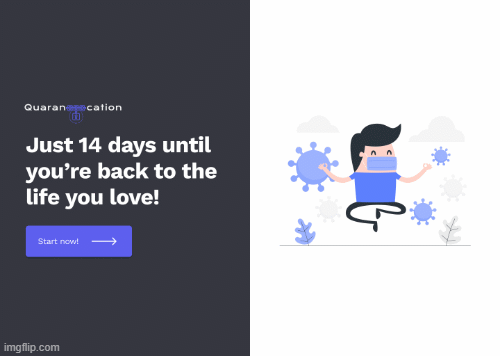

# Quarancation - Hack the North 2021

## Video Demo & Project on DevPost
https://youtu.be/k-TY50Qt7PA
https://devpost.com/software/quarancation

## Inspiration
The COVID-19 pandemic has gone back and forth for 21 months. Canada is now in its 4th wave of the pandemic as cases spike. 
It was proven that conscious self-isolation can significantly reduce the probability of infection, which means the 5th wave can be avoidable. However, according to observation, this is incredibly difficult for Canadians. 

## What it does
Quarancation is an application to assist in identification and detection. It determines whether people have consciously performed a qualifying self-isolation during the first 14 days of their entry into Canada. 
Quarantines are now as interesting as a personalized Instagram with facial recognition that tags your digital identity in the profile. The app also provides alerts to help users keep track of their active check-ins during quarantines.

## How we built it
1. We started by brainstorming functions we want to integrate into the app. Meanwhile, we collected useful APIs, UI design software and existing framework for building the architecture. 
2. Front-End: we used figma to design the interface, and we used react.js. 
3. Back-End: we used Flask and connected it with Azure cognitive API that recognizes the face of a user. In addition to that, we added used authentication using google credentials.
4. We used a Geolocation Python script as our tagging machine to verify if the user stayed in the same place as their registered quarantine location. 

## Challenges we ran into
1. The most challenging task we had was to practice what we only just learned.
2. The most challenging task was to combine all the parts into one and make a complete web application. The connection of the API to the web application was the next hardest thing
3. It is my second hackathon and my first time going for a submission, so I was exposed to a lot of new things and concepts especially for web-app.
4. Given that I had very little experience with front-end web dev, I had to learn very quickly to at least try and put some workable user interface together. Definitely didn’t help that we started the front end at 2am.

## Accomplishments that we're proud of
1. For images uploaded by our app users, our Geolocation script can quickly fetch information of the GPS, shooting device, time and location. 
2. We were able to formulate an idea and come up with a plan to execute it with different APIs and concepts.

## What we learned
1. The mysteries behind the blockchain, distinguishing and adopting the correct API.
2. How the different cloud platforms provide various facial recognition API and I got to learn from Azure and Gcs.
3. Learned the basics of hashing and encrypting Strings and files using python 
4. The fundamentals of using React and HTML/CSS to develop out the front-end

## What's next for Quarancation
We hope to integrate the following features:

1. Guaranteeing user data privacy through cryptographic technologies such as zero-knowledge proof and homomorphic encryption.
2. Making face features as pass private key: Based on facial recognition technology and AI algorithm, it can accurately verify users' identity by face and protect account security.
3. Completing data trustworthiness: Based on the blockchain's tamper-evident and traceability, the trustworthiness of user data is guaranteed.
4. Aggregate data fragments among users' applications: After users' authorization, they can connect the data fragments scattered among different applications. 
5. Even if COVID dies out, this app can be migrated into a children check-up app in the scenario that children are home alone and parents prompt them to send pictures 

# Getting Started - Geolocation
For images uploaded by our app users, this script can quickly fetch information of the their GPS, shooting device, time and location
For images uploaded by our app users, this script can quickly fetch information of the GPS, shooting device, time and location

1. Clone the repository
2. Install python3 (if you haven't already)
3. Install pip3 (if you haven't already)
4. Navigate to the root directory of the project
5. Install the required packages by using `pip3 install -r requirements.txt`
## Requirements
Meet the following requirements
1. Get the shooting information of specified pictures, such as local device, address, time, GPS, etc.
2. To obtain the information of a large number of pictures by traversing the specified picture directory
## Configurations
1. The program has two parameters -d and -p, we can specify the image directory or image file
2. For example, execute the following command:
    1. `python ImageLocation.py -d c:\\111`  
    2. `python ImageLocation.py -p 123.jpg`  
   

# Getting Started - Create React App

This project was bootstrapped with [Create React App](https://github.com/facebook/create-react-app).

## Available Scripts

In the project directory, you can run:

### `npm start`

Runs the app in the development mode.\
Open [http://localhost:3000](http://localhost:3000) to view it in the browser.

The page will reload if you make edits.\
You will also see any lint errors in the console.

### `npm test`

Launches the test runner in the interactive watch mode.\
See the section about [running tests](https://facebook.github.io/create-react-app/docs/running-tests) for more information.

### `npm run build`

Builds the app for production to the `build` folder.\
It correctly bundles React in production mode and optimizes the build for the best performance.

The build is minified and the filenames include the hashes.\
Your app is ready to be deployed!

See the section about [deployment](https://facebook.github.io/create-react-app/docs/deployment) for more information.

### `npm run eject`

**Note: this is a one-way operation. Once you `eject`, you can’t go back!**

If you aren’t satisfied with the build tool and configuration choices, you can `eject` at any time. This command will remove the single build dependency from your project.

Instead, it will copy all the configuration files and the transitive dependencies (webpack, Babel, ESLint, etc) right into your project so you have full control over them. All of the commands except `eject` will still work, but they will point to the copied scripts so you can tweak them. At this point you’re on your own.

You don’t have to ever use `eject`. The curated feature set is suitable for small and middle deployments, and you shouldn’t feel obligated to use this feature. However we understand that this tool wouldn’t be useful if you couldn’t customize it when you are ready for it.

## Learn More

You can learn more in the [Create React App documentation](https://facebook.github.io/create-react-app/docs/getting-started).

To learn React, check out the [React documentation](https://reactjs.org/).

### Code Splitting

This section has moved here: [https://facebook.github.io/create-react-app/docs/code-splitting](https://facebook.github.io/create-react-app/docs/code-splitting)

### Analyzing the Bundle Size

This section has moved here: [https://facebook.github.io/create-react-app/docs/analyzing-the-bundle-size](https://facebook.github.io/create-react-app/docs/analyzing-the-bundle-size)

### Making a Progressive Web App

This section has moved here: [https://facebook.github.io/create-react-app/docs/making-a-progressive-web-app](https://facebook.github.io/create-react-app/docs/making-a-progressive-web-app)

### Advanced Configuration

This section has moved here: [https://facebook.github.io/create-react-app/docs/advanced-configuration](https://facebook.github.io/create-react-app/docs/advanced-configuration)

### Deployment

This section has moved here: [https://facebook.github.io/create-react-app/docs/deployment](https://facebook.github.io/create-react-app/docs/deployment)

### `npm run build` fails to minify

This section has moved here: [https://facebook.github.io/create-react-app/docs/troubleshooting#npm-run-build-fails-to-minify](https://facebook.github.io/create-react-app/docs/troubleshooting#npm-run-build-fails-to-minify)
